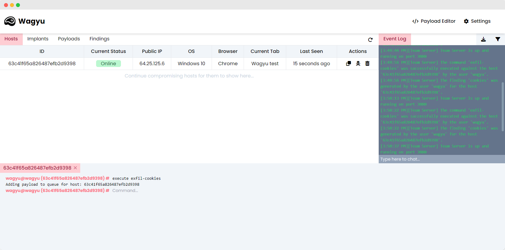

# Wagyu XSS
A dynamic cross-site scripting (XSS) payload delivery system with team server abilities.

## Features
- Collaborative team server capabilities
- Standalone cross-platform client
- Fully customisable, users, implants and payloads
- Dynamic cross-site scripting payload delivery system
- Exportable team event log
- Live team chat

 
---
## Installation
Please check out the [Wiki](https://wagyu-docs.jamiepegg.com/) for installation instructions.

## To-do List
### Client
- [ ] Delete Hosts
- [ ] Drag to resize?
- [ ] Right click menu

### Server
- [ ] More operations need to be added to the event log
- [ ] Obfuscate/Minify payloads
- [ ] Change database initial seed to a script not container. This will enable the default user to be created with a time.
