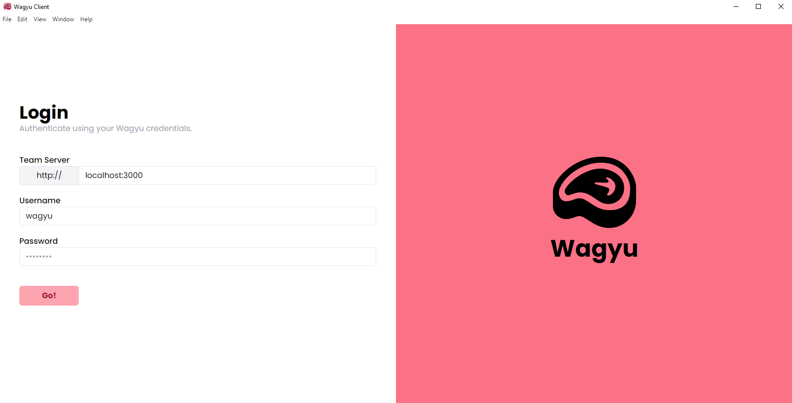
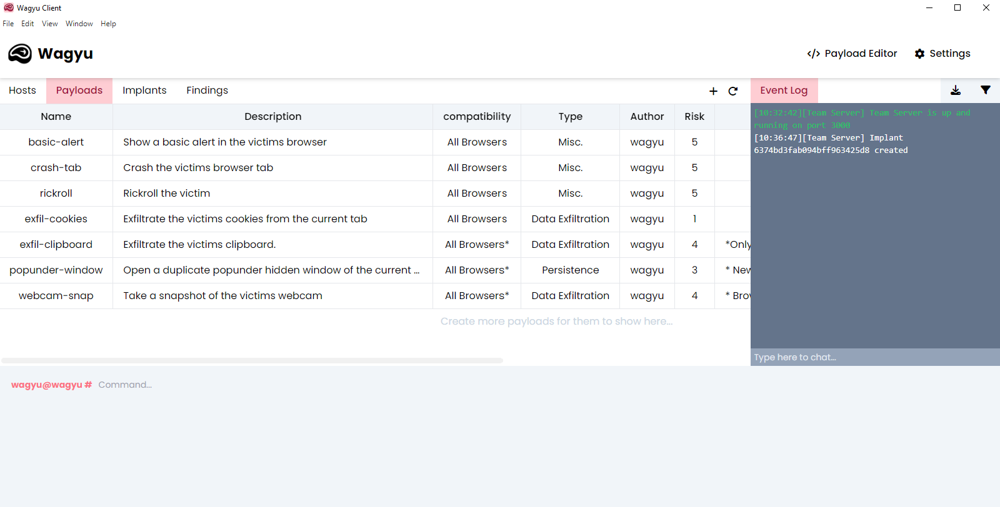

# Wagyu XSS
A dynamic cross-site scripting (XSS) payload delivery system with team server abilities.

- Standalone desktop client GUI
- Collaborative Team Server

 
---
## Installation
Please check out the [Wiki](https://wagyu-docs.jamiepegg.com/) for installation instructions.

## To-do List
### Client
- [x] Host changes to offline when not called back for 5 mins
- [x] Modal windows for user management
- [x] Risk help info button (hover)
- [x] 'Login failed' UI response
- [ ] Drag to resize?
- [ ] Implant jitter?
- [ ] Command prompts are per-host (not one single prompt)
- [ ] Right click menu

### Server
- [x] Implant callback interval
- [x] Validate teamserver address when generating implants (remove trailing /, add protocol etc).
- [x] Send loot to findings tab
- [x] Validate user session
- [x] Account logout
- [x] Change Password (admin only)
- [x] Account privileges (admin user can add, modify users - that's all)
- [x] Create/Edit users
- [ ] More opperations need to be added to Event log
- [ ] Export event log option
- [ ] Obfuscate/Minify payloads

### Misc
- [x] Explain env vairables in README.md
- [ ] Wiki (in progress)
- [ ] Change database initial seed to a script not container. This will enable the default user to be created with a time.

## Known Issues
* If a payload redirects the user, the command to set the payload as executed is never complete. Therefore, the redirect happens whenever the user returns to the page.
* Unacknowledged alerts cause the script to hang and queue is never cleared.
* Command history isn't fetched until a command is executed on first launch.