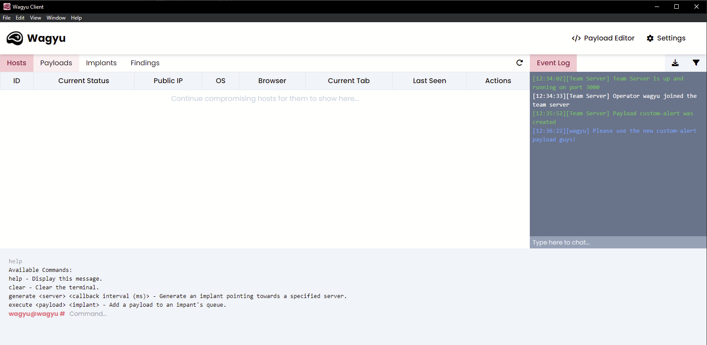

# Wagyu

Wagyu is a dynamic cross-site scripting (XSS) payload delivery system with team server abilities.


Wagyu is still in early stages of development, therefore, you may experiance bugs/incomplete features.


### Features

* Collaborative team server capabilities
* Standalone cross-platform client
* Fully customisable, users, implants and payloads
* Dynamic cross-site scripting payload delivery system
* Exportable team event log
* Live team chat

<figure><figcaption></figcaption></figure>
