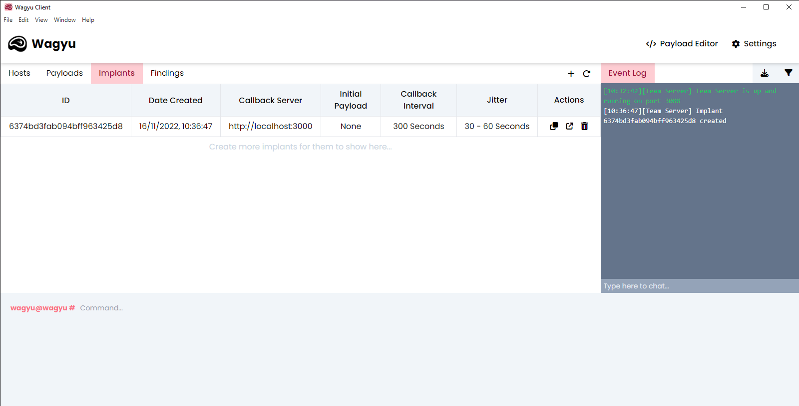

# Implants

In Wagyu an implant is a small javascript file used by hosts to communicate with the server. Implants are bidirectional and are responsible for sending commands to and from the hosts/server.

<figure><figcaption><p>Implants Table</p></figcaption></figure>

### Implant Structure and Communication


Unfortunately, at the time of writing, the default implant code cannot be changed within the client.


A basic overview of how an implant and the server communicate can be seen below:

1. The target host initially fetches the implant from the server at `http://<server_address>:<port>/<implant_id>.js`
2. The target host sends a `POST` request to `http://<server_address>:<port>/register`containing initial info such as the User-Agent, Public IP and current tab
3. The server responds to the request with an ID for the host and an initial payload (if set). The hosts ID is stored within a cookie specified when creating the implant (default: `HID`).
4. The target host executes the initial payload (if set) and sends the result back to the server at `http://<server_address>:<port>/<host_id>`.&#x20;
5. The target host calls back to the server at `http://<server_address>:<port>/<host_id>`. The server then responds with the command queue.
6. The target host executes the command in the queue (if any) and sends the results to `http://<server_address>:<port>/<host_id>`. The server then responds with the new queue and this is repeated over and over.

### Implant Jitter

Jitter can be set when creating an implant and is a random time which is added on to the implants callback time. This helps the traffic to and from wagyu appear more random and natural which is useful for avoiding detection from firewalls.&#x20;

The following, can be specified when creating an implant:

* **Callback Interval** - The base time interval in which a host will callback to the server
* **Minimum Jitter** - The minimum jitter to be added or subtracted from the callback interval
* **Maximum Jitter** - The maximum jitter to be added or subtracted from the callback interval. This must be less than the callback interval and more than the minimum jitter.

Using the above variables, the implant uses the following math to create a random callback time each interval.

```javascript
var interval = callbackInterval + ((Math.random() * (maxJitter - minJitter) + minJitter) * (Math.random() < 0.5 ? -1 : 1));
```

This generates a random number between the minimum and maximum jitter and then multiplies this by either `-1` or `1` (making it randomly positive or negative). This value is then added to the base callback Interval.
