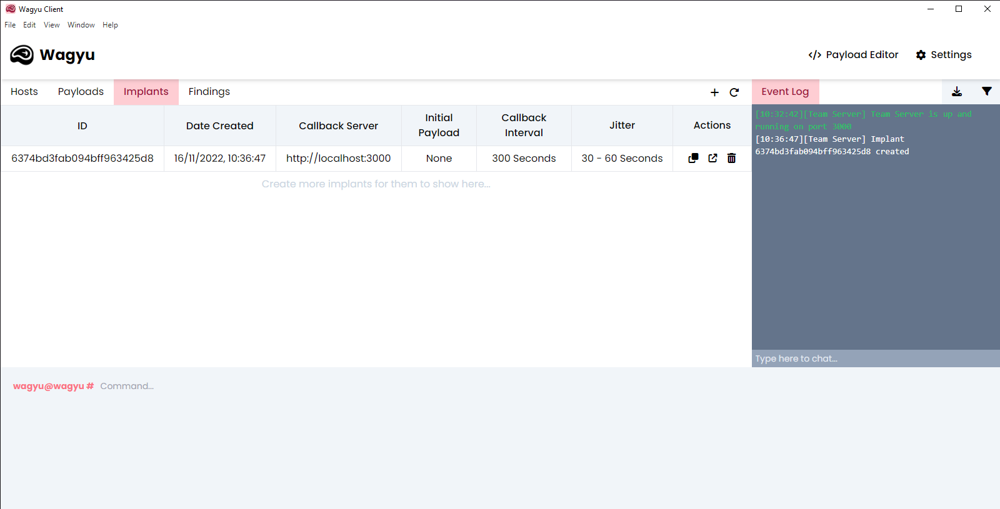
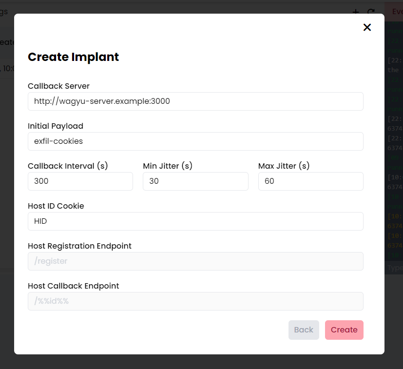

# Creating Implants

<figure><figcaption>
Implants Table
</figcaption></figure>

 

<figure><figcaption>
Create Implant Page
</figcaption></figure>

Within the Wagyu client you can use the "**+**" icon at the top of the implants table to create implants. If you want to get started quickly, Wagyu will autofill all of the fields for you using default values.&#x20;

When creating an implant you are able to specify the following fields:


At the time of writing the `Host Registration Endpoint` and `Host Callback Endpoint`are not customisable.


| Field                      | Default                      | Description                                                                                                                                          |
| -------------------------- | ---------------------------- | ---------------------------------------------------------------------------------------------------------------------------------------------------- |
| Callback Sever             | Authenticated Server Address | The address which an implant will callback to                                                                                                        |
| Initial Payload            | `None`                       | The initial payload which will be executed                                                                                                           |
| Callback Interval          | `300`                        | The base callback time in seconds. We do not recommend anything less than 10 seconds                                                                 |
| Min Jitter                 | `30`                         | The minimum jitter to be added/subtracted from the Callback Interval in seconds. More information on jitter can be found [here](./#implant-jitter)   |
| Max Jitter                 | `60`                         | The maximum jitter to be added/subtracted from the Callback Interval in seconds. More information on jitter can be found [here](./#implant-jitter)   |
| Host ID Cookie             | `HID`                        | The cookie used by a host to store its ID. More information on how this cookie is used can be found [here](./#implant-structure-and-communication)   |
| Host Registration Endpoint | `/register`                  | The server endpoint to register a host. More information on endpoints can be found [here](./#implant-structure-and-communication)                    |
| Host Callback Endpoint     | `/<host_id>`                 | The server endpoint in which a host calbacks to with data. More information on endpoints can be found [here](./#implant-structure-and-communication) |


If you do not want any jitter please use `0` for both the minimum and maximum jitter values.


After filling in all of the fields click the "**Create**" button to create your implant. Once the implant has been generated it will show in the implants table. _Please note it may take a few seconds to appear in the table._&#x20;
