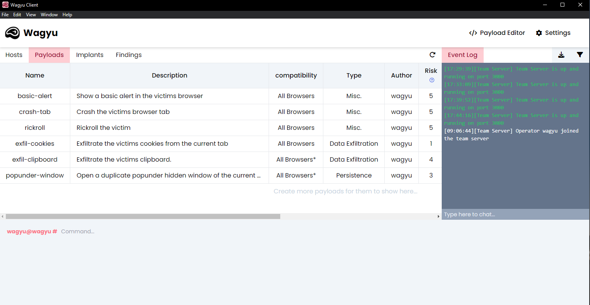
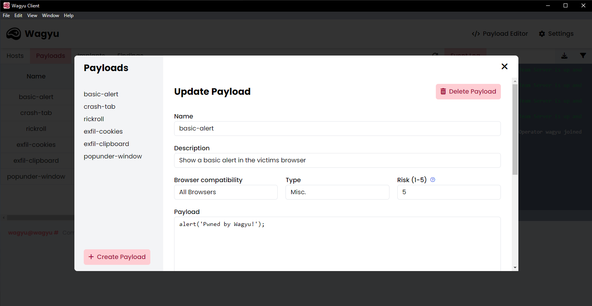

# Payloads

In the Wagyu client there are numerous payloads available during an engagement, some of which have been created by us, others can be created by the user. Payloads can be viewed from two pages within the Wagyu client; The payloads table and the payloads editor:

<figure><figcaption>
Payloads Table
</figcaption></figure>

 

<figure><figcaption>
Payload Editor
</figcaption></figure>

### Payload Types

Each payload is categorised by a type. The following types are currently available within Wagyu:

* Recon
* Lateral Movement
* Data Exfiltration
* Exploit
* Persistence
* Misc.

### Payload Risk

Each payload is given a risk between 1 and 5 which signifies how likely the victim is to notice the payload executing. For example, an alert box may be a 5 (very likely to notice) and something which runs in the background may be a 1 (unlikely to notice).

Other payloads such as out exfil-clipboard are given a medium risk score as a permission prompt will appear for the victim.

### Default Payloads

The table below outlines the default payloads currently available in Wagyu. The default payloads are seeded on first launch using the `mongo-seed/initPayloads.json` file:

<table><thead><tr><th>Name</th><th>Description</th><th>Type</th><th data-type="number">Risk</th></tr></thead><tbody><tr><td>basic-alert</td><td>Show a basic alert in the victims browser</td><td>Misc.</td><td>5</td></tr><tr><td>crash-tab</td><td>Crash the victims browser tab</td><td>Misc.</td><td>5</td></tr><tr><td>rickroll</td><td>Rickroll the victim</td><td>Misc.</td><td>5</td></tr><tr><td>exfil-cookies</td><td>Exfiltrate the victims cookies from the current tab</td><td>Data Exfiltration</td><td>1</td></tr><tr><td>exfil-clipboard</td><td>Exfiltrate the victims clipboard</td><td>Data Exfiltration</td><td>4</td></tr><tr><td>popunder-window</td><td>Open a duplicate popunder window of the current tab</td><td>Persistence</td><td>3</td></tr></tbody></table>

