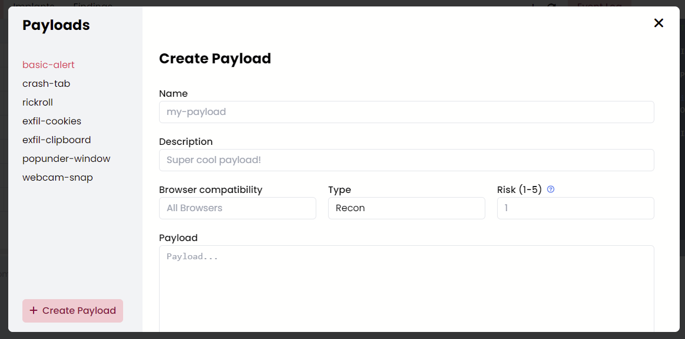

# Creating Payloads

Within the Wagyu client you can use the "**+**" icon at the top of the "**Payloads**" tab, or alternatively, access the payload editor directly using the "**Payload Editor**" button located at the top right of the application.

<figure><figcaption>
Payloads Table
</figcaption></figure>

 

<figure><figcaption>
Create Payload
</figcaption></figure>

From here, select "**Create Payload**" in the bottom left of the modal. You can then fill in the following fields:

<table><thead><tr><th>Field</th><th data-type="checkbox">Required</th><th>Description</th></tr></thead><tbody><tr><td>Name</td><td>true</td><td>The name of the payload. This should be unique</td></tr><tr><td>Description</td><td>true</td><td>A description for the payload</td></tr><tr><td>Browser Compatibility</td><td>true</td><td>Which browsers the payload will work in</td></tr><tr><td>Type</td><td>true</td><td>The type of payload. See more information on payload types <a href="./#payload-types">here</a></td></tr><tr><td>Risk</td><td>true</td><td>The payload risk. Find more information about payload risk <a href="./#payload-risk">here</a></td></tr><tr><td>Payload</td><td>true</td><td>The JavaScript code to be executed.</td></tr><tr><td>Notes</td><td>false</td><td>Any notes for the payload</td></tr></tbody></table>

Once you have filled in all of the required fields, click "**Create**" at the bottom of the modal to create the payload. Your payload should then appear within the "**Payloads**" tab.
