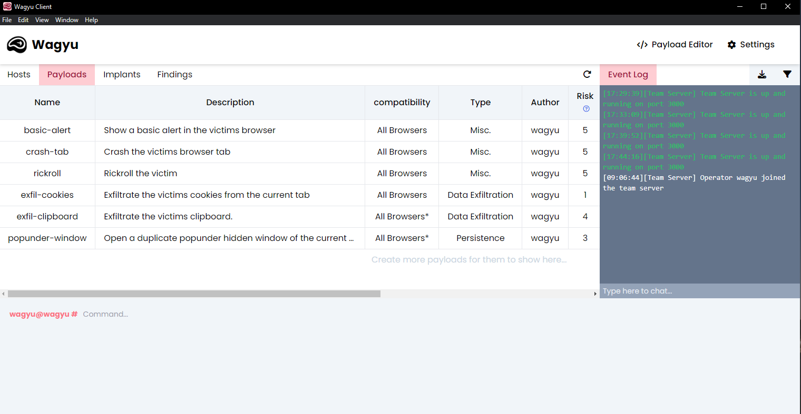

# Deleting Existing Payloads


Before continuing, please take note that deleted payloads cannot be recovered.


To delete an existing payload within the Wagyu client, first head to the "**Payloads**" tab. You can then select the bin icon from within the "**Actions**" column of the payload you wish to delete. The payload will then be removed from the tab.

<figure><figcaption>
Payloads Table
</figcaption></figure>
