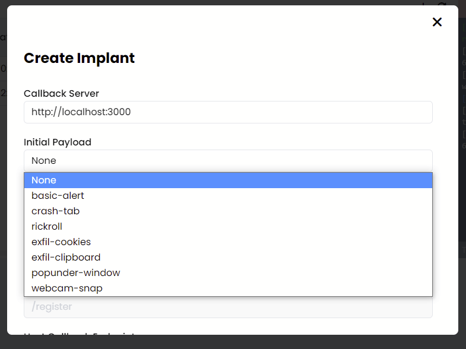

# Initial Payloads

Initial payloads can be set when creating an implant (see the image below for reference):

<figure><figcaption>
Initial Payload
</figcaption></figure>

 

<figure><figcaption>
Payloads Table
</figcaption></figure>

Initial payloads are payloads which are executed when a host is first registered. This is useful for tasks which you may want to perform straight away such as information gathering or reconnaissance.

When a host is registered the server will send the host its initial payload, the host will then execute this command respond with the results during the first callback.
