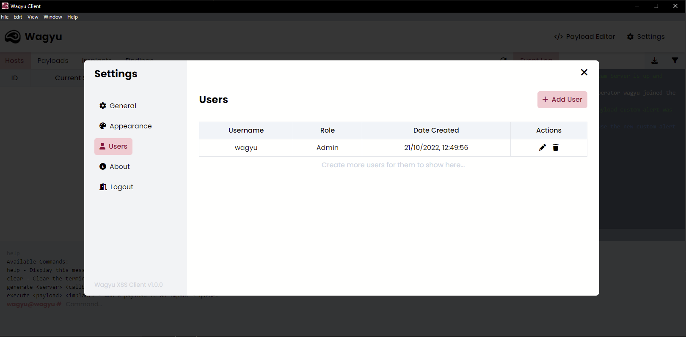

# Creating Users


Before continuing, please note creating users can only be performed by an admin user.


To create a user within Wagyu head to the "**Users**" page within the settings. From here, you can select "**Add User**" located above the users table.

<figure><figcaption>
Wagyu User Settings
</figcaption></figure>

 

<figure><figcaption>
Create User Page
</figcaption></figure>

From here you must provide the following for the user:

* **Username** - This is used to authenticate the user and will appear in the event logs.&#x20;
* **Role** - This determines the access level the new account will have. [Learn more](./#user-roles)
* **Password  -** A password the user will authenticate with.
* **Confirm Password** - Confirm the password the user will authenticate with.

Once all the above fields have been completed you can then click "**Create**" which will create the new user account. An overview of all the user can be found within the "**Users**" page in the settings.
